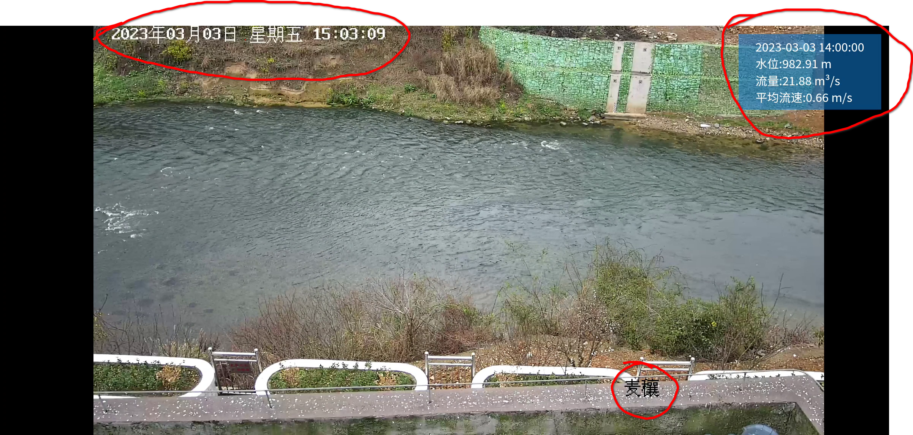
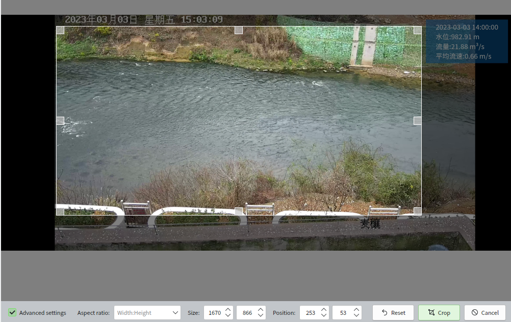
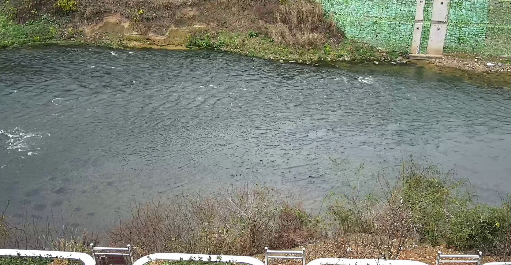

# 使用ffmpeg对河道监控视频进行水体分析预处理

首先，我们从“武大AiFlow视频测流”小程序录制了两段水体监控视频。其中一段（麦穰天然河道）已经上传至视频平台：[【“武大AiFlow视频测流”小程序麦穰流道录屏】](https://b23.tv/0n3ivPQ)

但是这些视频存在一些缺陷，不能直接用于水体分析：

1. 录制帧率与原始帧率不一致，视频播放具有顿挫感。存在太多的重复视频帧。
2. 录制的视频存在黑边、文字遮挡的情况。可能造成干扰，不利于水体分析。
3. 录制的视频文件过大，不适合网络共享学习和视频分析处理。

我们可以使用ffmpeg命令行快速地克服上述缺陷以获取质量合格的素材。

## 去除重复帧

ffmpeg一大重器便是filter（滤镜、过滤器）。对于重复帧，我们可以使用视频滤镜中的 mpdecimate 进行去除。

ffmpec doc 中对mpdecimate滤镜的介绍是这样的：

> Drop frames that do not differ greatly from the previous frame in order to reduce frame rate. 

总而言之，用就对了。

```
ffmpeg -i input.mp4 -vf "mpdecimate" output.mp4
```

-vf 代表着 --video-filter，其后的双引号内可以使用滤镜。

我们还可以使用 setpts 滤镜调整时间轴相关的配置。

```
ffmpeg -i input.mp4 -vf "setpts=N/FRAME_RATE/TB" output.mp4
```

N 视频帧的个数
FRAME_RATE 帧速率
TB 时间轴基准（尺子的刻度精度）

如此一来，N/FRAME_RATE/TB表达式的含义就是按照时间轴基准将所有帧一帧一帧的从前往后排布，每秒可以放FRAME_RATE这么多的帧。

此外，我们还可以使用 -r 设定视频的帧率。

我们可以结合 mpdecimate、-r 和 setpts，得到一个依照原有时间基准修改且没有重复帧的视频输出，其帧率为60。

```
ffmpeg -i input.mp4 -vf "mpdecimate,setpts=N/60/TB" -r 60 output.mp4
```

成品看上去很不错！流畅的水流！每一帧都有意义！

## 裁剪视频画面

原始视频中含有一些干扰项，比如文字和带颜色的数据展板，在下图中使用红圈进行了标注。



    我们可以用crop过滤器对画面进行裁剪。使用 crop 需要几个参数w、h、x、y。分别代表宽度、高度、起始横坐标、起始竖坐标。如果你接触过图像处理，应该会很熟悉。

    我们可以用图片工具处理视频截图，确定自己要裁剪的范围。



    这样我们就得到了对应的四个数据了。

 ```
    ffmpeg -i input.mp4 -vf "crop=1670:866:253:53" output.mp4
 ```

    我们从裁剪过的视频中再次截图，可以发现裁剪生效了。



## 编码与质量

    学习使用新技术会有成本，但所幸，在ffmpeg面前，你只需要输入一些字符串就可以了。我们使用x265编码器以压缩文件大小。

```
    ffmpeg -i input.mp4 -c:v libx265 -crf 24 output.mp4
```
    我们使用 -c 表明我们要进行 编码/解码 操作，冒号后面的v指明对视频进行操作（Video）。libx265 则是解码器的名字， -crf是该解码器的质量设置选项，我们使用 crf 为 24（相对中等的压缩质量）。


## 去除音频轨道

    值得一提的是，我们只需要视频。水体分析完全不需要音频，我们可以把音频给删除掉。

```
    ffmpeg -i input.mp4 -map 0:v:0 output.mp4
```

    第一个0指的是第一个输入文件，v照样指的是Video,第二个0指第一个轨道。所以，0:v:0 指的是“第一个输入文件的第一个视频轨道”。我们使用map把它映射到output.mp4上去。

    就像是化学实验中的提纯操作一般。经过上述操作，我们听不到录制时室友的呼噜声了！只留下缓缓流动的安详河流。


## 视频长度裁剪

    也许水体分析不用太多的数据，只需要几十帧，我们可以裁剪视频长度来达成这一点。我们裁剪个一秒吧！

    裁剪视频在ffmpeg中很简单，因为很常用，甚至有了专门的指定选项。在这里，我们使用 -ss 和 -to。

```
    ffmpeg -i input.mp4 -ss 0.0 -to 1.0 output.mp4
```

    简单吧！从0.0秒裁剪到1.0秒！

## 综合使用

    我们可以一次性指定许多操作，比如说下面这条指令可以直接输出用来水体分析的图片集合与视频。

```
    mkdir -p output.mp4 && ffmpeg -i video_raw/麦穰-天然河道.mp4  -map 0:v:0 -vf "crop=1670:866:253:53,mpdecimate,setpts=N/60/TB" -r 60 -ss 0.25 -to 0.75 -c:v libx265 -crf 16 output/video.mp4 && ffmpeg -i output/video.mp4 output/%03d.jpg
```

